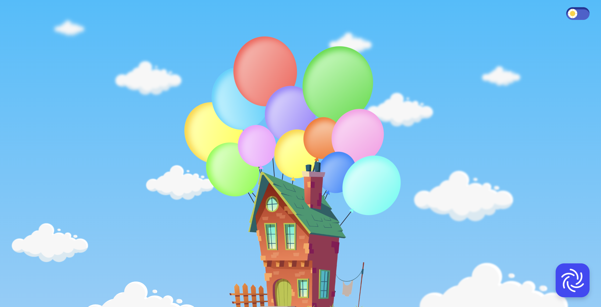

# 풍선의 움직임을 표현해보자!



<br />

# 목차

[1. 배포 링크](#배포)
<br />
[2. 프로젝트 실행 방법](#프로젝트-실행-방법)
<br />
[3. 기술 스택과 폴더 구조](#기술-스택)
<br />
[4. 기능 구현](#기능-구현)

> [1. 전체적인 레이아웃](#1-전체적인-레이아웃)

> [2. 풍선 만들기](#2-풍선-만들기)

> [3. 집과 풍선의 관계](#3-집과-풍선의-관계)

> [4. 풍선과 바람의 관계](#4-풍선과-바람의-관계)

> [5. 배경 만들기](#5-배경-만들기)

[5. 회고](#회고)

<br />

# 배포

### [👉 사이트 바로가기](https://balloon-event.vercel.app/)

<br />

## 프로젝트 실행 방법

1. 프로젝트 clone

```bash
$ git clone https://github.com/gamangee/balloon-event.git
```

2. 프로젝트 directory로 이동

```bash
 $ cd balloon-event
```

3. 프로젝트 관련 라이브러리 다운로드

```bash
$ npm install
```

4. 프로젝트 실행

```bash
$ npm start
```

<br />

## 기술 스택


<br />

## 📂 폴더 구조

```bash
src
 ┣ assets
 ┃ ┗ cloud.js
 ┣ components
 ┃ ┣ AddBalloons.js
 ┃ ┣ Background.js
 ┃ ┣ Clouds.js
 ┃ ┣ ModeSwitch.js
 ┃ ┣ OriginBallons.js
 ┃ ┗ Wind.js
 ┣ context
 ┃ ┗ ModeContext.js
 ┣ styles
 ┃ ┣ GloblStyles.js
 ┃ ┗ theme.js
 ┣ utils
 ┃ ┗ getRandoms.js
 ┣ App.js
 ┗ index.js
```

<br />

# 기능 구현

## 1. 전체적인 레이아웃

```javascript
<Container>
  <Background />
  <AddBalloons />
  <OriginBallons />
  <ModeSwitch />
  <Wind />
</Container>
```

✅ 가로를 min-width를 1300px 설정하여 반응형을 고려하지 않았습니다.
<br />
✅ 세로는 100vh로 스크롤이 생기지 않는 원 페이지로 제작하였습니다.
<br />
✅ 하늘 배경 위에 화면 중앙 하단에 집이 있고, 집에 매달려있는 끈이 달린 풍선이 존재합니다.
<br />

## 2. 풍선 만들기

### 2-1. 풍선 속성 정의하기

```javascript
const originBalloons = [
  {
    id: id(),
    color: "#ffd107",
    gradient: "linear-gradient(135deg, #ffffc1, #ffff00)",
    shadow: "#ffd103",
    size: "90",
    top: "300px",
    left: "450px",
    deg: "-30deg",
  },
  ...
]
```

✅ 풍선의 색, 크기, 위치, 기울기 정보를 originBalloons 배열에 한 곳에 모았습니다.
<br />

### 2-2. 풍선 배치하기

```javascript
{
  originBalloons?.map((balloon, index) => (
    <BalloonShape
      key={balloon.id}
      top={balloon.top}
      left={balloon.left}
      deg={balloon.deg}
    >
      <Balloon
        color={balloon.color}
        gradient={balloon.gradient}
        shadow={balloon.shadow}
        size={balloon.size}
        index={index}
      />
    </BalloonShape>
  ));
}
```

✅ BalloonShape에서 먼저 위치와 기울기를, Balloon에서는 나머지 풍선 색과 크기를 설정하였습니다.
<br />
✅ Balloon 스타일 컴포넌트 가상선택자로 매듭과 끈을 만들어 실제 풍선과 비슷하게 구현하였습니다.
<br />

### 2-3. 새로운 풍선 추가하기

```javascript
const addBalloon = () => {
  let randomTop = getRandomNumber(100, 500);
  let randomLeft = getRandomNumber(100, 1200);

  let randomRotation;
  if (randomLeft <= window.innerWidth / 2) {
    randomRotation = getRandomNumber(-30, 0);
  } else {
    randomRotation = getRandomNumber(0, 30);
  }

  const { shadow, gradient } = getRandomColor();

  setBalloons((prevBalloons) => {
    return [
      ...prevBalloons,
      {
        id: id(),
        color: shadow,
        gradient: gradient,
        size: getRandomSize(),
        top: `${randomTop}px`,
        left: `${randomLeft}px`,
        deg: `${randomRotation}deg`,
      },
    ];
  });
};
```

✅ 풍선을 새롭게 추가할 때 크기, 위치, 기울기, 색이 모두 랜덤하게 달라질 수 있도록 getRandomNumber, getRandomColor, getRandomSize 유틸 함수를 만들었습니다.
<br />
✅ `window.innerWidth`를 이용하여 화면 왼쪽에 생성되었을 때는 기울기를 마이너스, 오른쪽에 생성되었을 때는 플러스가 되도록 조건을 주었습니다.
<br />

### 2-4. 풍선 제거하기

```javascript
const removeBalloon = (id) => {
  setBalloons((prevBalloons) =>
    prevBalloons.filter((balloon) => balloon.id !== id)
  );
};
```

✅ 풍선을 제거할 때 고유한 id를 가지고 일치 여부를 확인해야하기 때문에 uuid 라이브러리를 사용하여 id를 생성하였습니다.
<br />
✅ filter 메소드를 사용하여 풍선의 id가 클릭한 id와 일치했을 때 제거를 해주었습니다.
<br />

## 3. 집과 풍선의 관계

### 3-1. 집이 풍선에 묶여 있는 효과 주기

```javascript
const originBallonVariants = (left) => {
  const leftPercentage = parseFloat(left.split("p")[0]);
  const moveDirection = leftPercentage < window.innerWidth / 2 ? 10 : -10;
  return {
    hidden: {
      scale: 1,
      opacity: 1,
      x: 0,
      y: 0,
    },
    visible: {
      scale: 1.5,
      opacity: 1,
      x: [moveDirection + "px", 0 + "px", moveDirection + "px"],
      y: "2px",
      transition: {
        x: { repeat: Infinity, duration: 2, ease: [0.42, 0, 0.58, 1] },
        type: "spring",
        bounce: 0.3,
      },
    },
    exit: { scale: 0, opacity: 0, transition: { duration: 0.2 }, x: 0, y: 0 },
    flyAway: { y: "-100vh", transition: { duration: 2 } },
  };
};
```

✅ framer-motion 라이브러리를 사용하여 애니메이션 효과를 구현하였습니다.
<br />

> ✍🏻 **framer-motion을 사용한 이유** > <br />
> 초기에 스타일 컴포넌트의 props를 이용하여 풍선 클릭 여부를 boolean 값으로 전달해 주었습니다. 하지만 애니메이션은 React의 렌더링 주기와는 별개로 동작하기 때문에 예상치 못한 문제가 발생했습니다. props의 상태가 바뀌면 React는 컴포넌트를 다시 렌더링하고, 이때 animation 속성이 다시 설정되어 애니메이션이 시작되어 원하는 효과를 구현할 수 없었습니다. 이에 React의 렌더링 주기와 충돌하지 않는 framer-motion 라이브러리를 사용하였습니다.
> <br />

✅ `window.innerWidth`를 이용하여 화면을 좌/우로 구분하여 왼쪽과 오른쪽에 각각 다른 효과를 적용하여 마치 풍선이 집에 묶여 있는 듯한 느낌을 표현하였습니다.
<br />

### 3-2. 집을 클릭 시 풍선 생성

```javascript
<House>
  <HouseImage
    onClick={handleHouseClick}
    src="/images/home.png"
    variants={houseVariants}
    initial="initial"
    animate={houseFloating ? "flyAway" : "initial"}
  />
</House>
```

✅ 집 이미지를 클릭 시 handleHouseClick 함수가 실행되며 이 함수 안에 addBalloons 함수가 호출되어 새로운 풍선이 생겨나게 됩니다.
<br />

## 4. 풍선과 바람의 관계

### 4-1. 바람이 불면 일어나는 일

```javascript
const handleWindButtonClick = () => {
  setWindBlowing(true);
  if (balloons.length >= 15 && originBalloons) {
    setHouseFloating(true);
  }
  setTimeout(() => {
    setWindBlowing(false);
    setHouseFloating(false);
    setBalloons([]);
  }, 3000);
};
```

✅ WindButton을 클릭 하면 새로 생성한 풍선이 모두 위로 날아갑니다.
<br />
✅ 새 풍선의 개수가 15개 이상일 때 기존 풍선과 집이 함께 위로 날아갑니다.
<br />

### 4-2. 바람 아이콘 360도 회전 시키기

```javascript
const WindImage = styled.img`
  animation: ${rotate360} 2s linear infinite;
  &:hover {
    animation: ${rotate720} 1s linear infinite;
  }
`;
```

✅ 스타일 컴포넌트의 keyframes를 사용하여 바람개비 효과를 주었습니다.
<br />
✅ 마우스 hover 시에는 더 빠르게 회전하도록 설정하였습니다.

## 5. 배경 만들기

### 5-1. 낮과 밤 하늘

```javascript
export default function App() {
  const { isDarkMode } = useMode();
  const theme = isDarkMode ? darkTheme : lightTheme;

  return (
     <ThemeProvider theme={theme}>
        {children}
     </ThemeProviter>
  )
}
```

✅ contextAPI와 스타일 컴포넌트 ThemeProvider를 사용하여 다크/라이트 모드를 구현하였습니다.
<br />

### 5-2. 스위치

```javascript
const SwitchInput = styled.input`
  opacity: 0;
  width: 0;
  height: 0;

  &:checked + ${OnAndOff} {
    background-color: #f2d522;
    box-shadow: inset 1px 5px 1px #e3ae56;
  }

  &:checked + ${OnAndOff}::before {
    transform: translateX(26px);
  }
`;
```

✅ input 태그의 checked 속성을 이용하여 낮과 밤의 하늘을 바꿀 수 있게 구현하였습니다.
<br />

### 5-3. 둥실둥실 떠있는 구름

```javascript
const cloudsProperty = [
  {
    top: "90%",
    left: "15%",
    deg: "10deg",
    blur: "0",
    width: "270px",
    height: "150px",
    animationduration: "3s",
  },
];

export default function Clouds() {
  return (
    <Container>
      {cloudsProperty.map((cloudProperty) => (
        <CloudImage key={id()} {...cloudProperty}>
          <Cloud width={cloudProperty.width} height={cloudProperty.height} />
        </CloudImage>
      ))}
    </Container>
  );
}
```

✅ 구름의 위치, 크기, 기울기, 속도의 정보를 담고 있는 cloudsProperty 배열을 생성하고, map 메서드를 사용하여 제각기 다른 구름을 만들었습니다.
<br />

# 회고

### 📚 새롭게 알게된 점

#### 스타일 컴포넌트의 `shouldForwardProp` 옵션

> **예시**
>
> ```javascript
> const BalloonShape = styled.div.withConfig({
>   shouldForwardProp: (prop) => !["top", "left", "deg"].includes >> prop,
> })`
>   position: absolute;
>   top: ${(props) => props.top};
>   left: ${(props) => props.left};
>   transform: rotate(${(props) => props.deg});
> `;
> ```

풍선을 이미지가 아닌 CSS로 직접 구현하다 보니 위치, 색상 등의 정보를 직접 정해주었습니다. 이 과정에서 콘솔에 노란색 경고문이 나와서 알게된 스타일 컴포넌트의 옵션이 있었습니다.

기본적으로 스타일 컴포넌트는 모든 prop을 내부의 DOM 요소에 전달하려고 합니다. 이는 기대한 동작이 아닐 수 있으며 때때로 원치 않은 스타일이나 속성이 브라우저의 DOM에 적용되는 결과를 초래할 수 있습니다.

이 문제를 해결하기 위해서는 `StyleSheetManager`에 있는 `shouldForwardProp`를 사용할 수 있습니다. 이를 통해 스타일링 로직에만 필요한 props가 DOM에 전달되지 않도록 필터링할 수 있습니다.

<br>

### 🌟 마무리하며

#### 아쉬운 부분도 있지만 뿌듯함은 2배

처음 구현해야할 사항들을 보면서 애니메이션 영화 '업'이 바로 떠올랐습니다. 그리고 업에서 나온 것처럼 풍선이 집을 들 수 있도록 만드는 것이 목표였습니다. 세부적으로는 바람 여부와 풍선 개수에 따라 풍선이 집을 들 수 있는지 없는지 결정되도록 조건을 걸었습니다.

작업을 하면서 CSS 속성에 대해 더 깊이 고민할 수 있어서 좋았습니다. 하지만 프로젝트를 진행하면서 계획했던대로 CSS를 완벽히 구현해 내기란 결단코 쉽지 않았습니다. 특히 풍선의 위치, 크기, 기울기 등을 조절하는 것이 가장 큰 고민이었습니다.

처음에는 vw를 이용하여 풍선의 위치를 계산하려고 시도했습니다. 하지만 이 방식은 풍선의 크기가 고정이였기에 화면 크기가 변하자 모든 것이 겹쳐지는 문제가 발생했습니다. 화면 크기에 따라 풍선 크기를 조절하는 부분까지 고려할 수가 없어 min-width를 이용하여 화면이 축소되더라도 풍선이 같이 반응하지 않게 수정하였습니다.

또한, 가상 선택자를 이용하여 풍선 끈을 구현하였는데 모든 풍선에 끈을 달아주지 못했습니다. 이 끈이 직선 형태였기 때문에, 새로 추가되는 풍선에 적용하기 어렵고 미관상 좋아 보이지 않았습니다. 이에 새로 추가한 풍선에는 이 부분을 적용하지 않기로 결정하였습니다.
